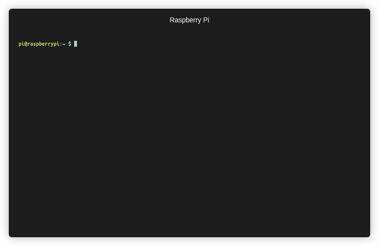

# 1.0 Set up the software <br>
<br>

<br>
<br>

This directory contains the source files for the application software that runs Alto. If you are building an Alto for the first time, you should use the downloadable software image, which comes fully configured out of the box. 

If you don’t want to make changes to Alto’s behaviour, then you can just use the first section of these instructions (['Using the SD card image](#using-the-sd-card-image-recommended))’). The other sections in this readme cover how to configure the OS, install the application software, and make changes to Alto’s behaviour in a little more detail.

**Skills required**
- Basic terminal commands

**Time to complete**
- 10 mins

**Things you’ll need**
- SD card image file ([download here](https://storage.cloud.google.com/experiments-uploads/alto_2021.bz2))
- microSD card (at least 8 GB capacity)
- Card reader
- Optional: wired keyboard and screen to connect to Raspberry Pi<br>
<br>

## Using the SD card image (recommended)

The supplied SD card image contains all the software needed to run Alto. It’s fully configured and ready to work out of the box—you just need to flash it to an SD card, insert it into the Raspberry Pi, and you’re ready to go! There are a couple of ways you can flash the SD card: using a GUI application, or using the terminal on your computer.<br>
<br>

### Flashing the SD card with a GUI tool

A GUI tool will give you a visual guide for flashing your SD card. The tool you need to use depends on the type of computer you have, as there are different tools for different platforms; a few examples include:

- [Raspberry Pi Imager](https://www.raspberrypi.org/software/)
- Etcher (Mac, Linux, Windows)
- Win32 Disk Imager (Windows)
- SD Card Association formatter (Mac & Windows)

You can find alternative applications and instructions for using each of these tools by searching the web. Note that the disk image itself is compressed to make downloading it easier, and you’ll need to uncompress it before flashing to the SD card.<br>
<br>


### Flashing the SD card using Terminal on your Mac

If you are using a Mac computer, you can use applications that run in your Terminal to write the image to the SD card. (These instructions will translate very closely to Linux and other Unix systems too, but you will need to research the specific commands for your system.)

1. Start by opening a Terminal session (Applications → Utilities → Terminal)

2. Navigate to the location you downloaded the disk image using the ```cd``` command, for example:
```
$ cd ~/Downloads/
```

3. Insert the SD card into your card reader, and use the ```diskutil list``` command to list the disks attached to your computer. 
```
 /dev/disk2 (external, physical):
#:         TYPE NAME                SIZE        IDENTIFIER
0:         FDisk_partition_scheme   *15.9 GB    disk2
1:         Windows_FAT_32 boot      45.0 MB     disk2s1
2:         Linux rootfs             15.9 GB     disk2s2
```

4. In the output of this command, look for the block that relates to your SD card (you can usually spot it from the size of the disk). You need to look for the ```IDENTIFIER``` for your disk. In the example above, our 16GB SD card is identified as ```disk2```

5. Use ```diskutil``` to unmount the disk, for example:
```
$ diskutil unmountDisk disk2
```

6. The disk is now unmounted, and we are ready to write the image to it. We can use the tools ```bzcat``` and ```dd``` to uncompress and write the image on the fly, respectively. Enter the following command to start writing the disk, inserting the image filename you downloaded and the ```IDENTIFIER``` of your disk (note that for a speed boost, you can add an ```r``` to the ```IDENTIFIER```, for example ```disk2``` becomes ```rdisk2```:
```
$ bzcat <IMAGE NAME> | sudo dd of=/dev/<IDENTIFIER>
```

For example, with the downloaded filename ```image.img.bz2``` and the ```IDENTIFIER``` as ```disk2```:
```
$ bzcat image.img.bz2 | sudo dd of=/dev/rdisk2 bs=32m
```

7. The time it takes to write the SD card image will depend on the speed of your card and the speed of the reader, but it will typically take between 10 and 20 minutes. When the writing has completed (when the terminal prompt is returned to you), you should use ```diskutil``` to eject the disk before removing it from your computer:
```
$ diskutil eject disk2
```
<br>

### Testing

Before proceeding to the next section, you should verify that your SD card has written correctly. To do this, insert it into the Raspberry Pi, connect a keyboard, screen, and the USB Accelerator, and connect the Pi to a USB power source. On its first boot, it may take a few minutes to verify the filesystem before a terminal appears on screen. After the filesystem check is complete, you should see a terminal on screen. Log in with the default username / password (pi / raspberry), then shut the system down by entering the ```poweroff``` command:
```
$ sudo poweroff
```
<br>

## Setting up from scratch (advanced)

It’s recommended to use the SD card image if you are setting up Alto for the first time, especially if you are not making any changes to its behaviour. This guide is included to give you an overview of the technical underpinnings of Alto which you can refer to if you wish to modify its code.<br>
<br>

### About the system

At Alto’s heart is a Raspberry Pi Zero and the Edge TPU in the Coral USB Accelerator. The Raspberry Pi Zero runs Raspberry Pi OS. It’s responsible for interfacing with the user’s connected hardware (connected via GPIO), the camera module, and the Edge TPU (connected via USB). The OS starts automatically, and acts as host for the software application that runs Alto.

The system accelerates all ML inferencing (and some of the learning) by delegating ML graph execution to the Edge TPU on the Coral USB Accelerator. The Edge TPU is a machine learning coprocessor that enables low-powered computers like the Raspberry Pi to run advanced ML workloads at a much greater level of performance than if they were run on CPU. All of the ML tasks performed by Alto are done on-device (offline) using the Edge TPU. You can find out more about Coral and the Edge TPU hardware on the [Coral website](https://coral.ai/products/).<br>
<br>

### OS & dependecies

The Raspberry Pi that runs Alto runs on Linux (the example SD card uses Raspbian Stretch Lite); you will need to get an installation image for your chosen OS from the web.<br>
<br>

#### Install using the setup script

This repository contains a setup script which will install all required dependencies and configure the OS to start the Alto software at launch. To use this script, log in to your system and either clone or copy the repo to the device. Change to the ```linux``` directory and run the script:
```
$ cd linux
$ sudo ./setup.sh
```

#### Install manually

1. From a freshly flashed image, install the OS dependencies
```
$ sudo apt-get update
$ sudo apt-get install -y git python3-picamera python3-pigpio python3-rpi.gpio
```

2. Enable the camera
```
$ sudo raspi-config
```

3. To reduce CPU usage, it’s recommended to edit ```/lib/systemd/system/pigpiod.service``` and append ```-s 10``` to the ```ExecStart``` line.

4. Enable ```pigpiod```
```
$ sudo systemctl enable pigpiod
$ sudo systemctl start pigpiod
```

5. Install the EdgeTPU Runtime and Python API
```
$ wget --content-disposition https://github.com/google-coral/edgetpu-platforms/releases/download/v1.9.2/edgetpu_api_1.9.2.tar.gz
$ tar xvf edgetpu_api_1.9.2.tar.gz
$ cd edgetpu_api
$ sudo bash install.sh
$ cd ..
```

6. Clone the Alto repository
```
$ mkdir ~/code
$ cd ~/code
$ git clone https://TODO Alto
```

7. Run the app
```
$ cd ~/code/alto/app
$ python3 alto.py
```

## :tada: Woohoo! You've finished this section :tada:


## Next section &#8594; [2.0: Build the electronics](2.0-Build-the-electronics.md)
