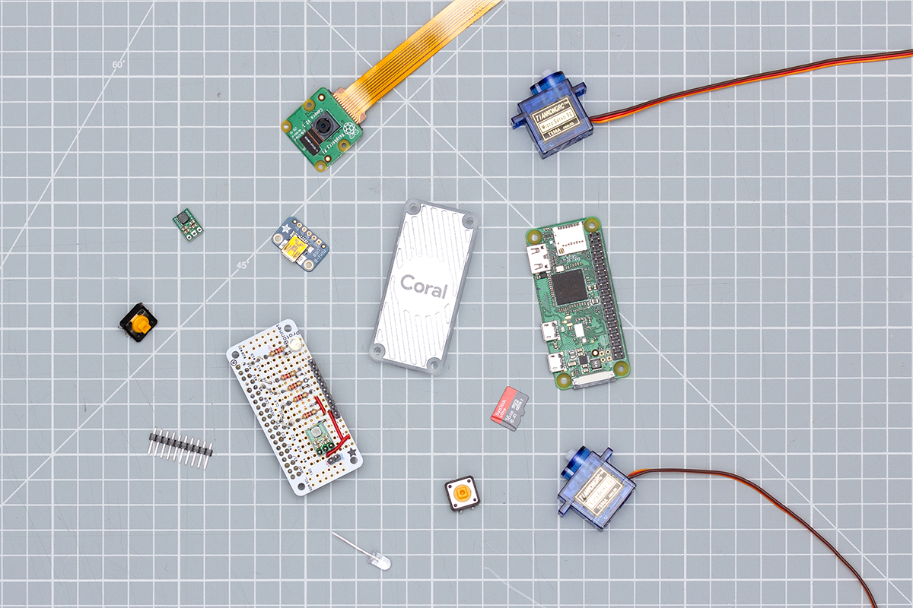
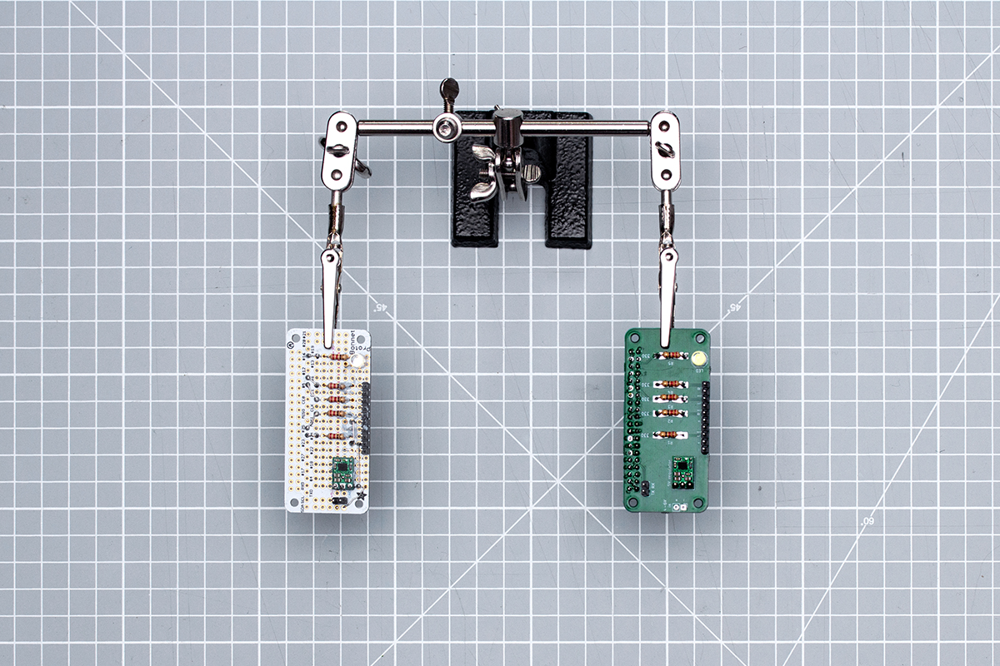
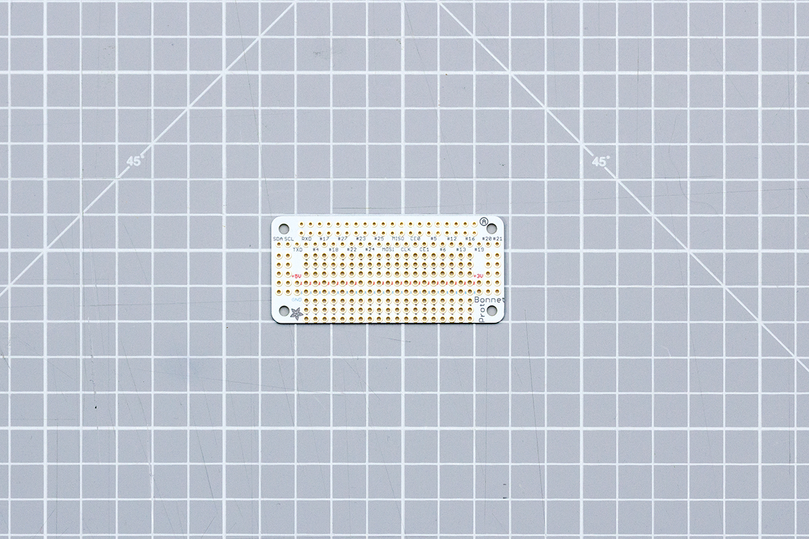
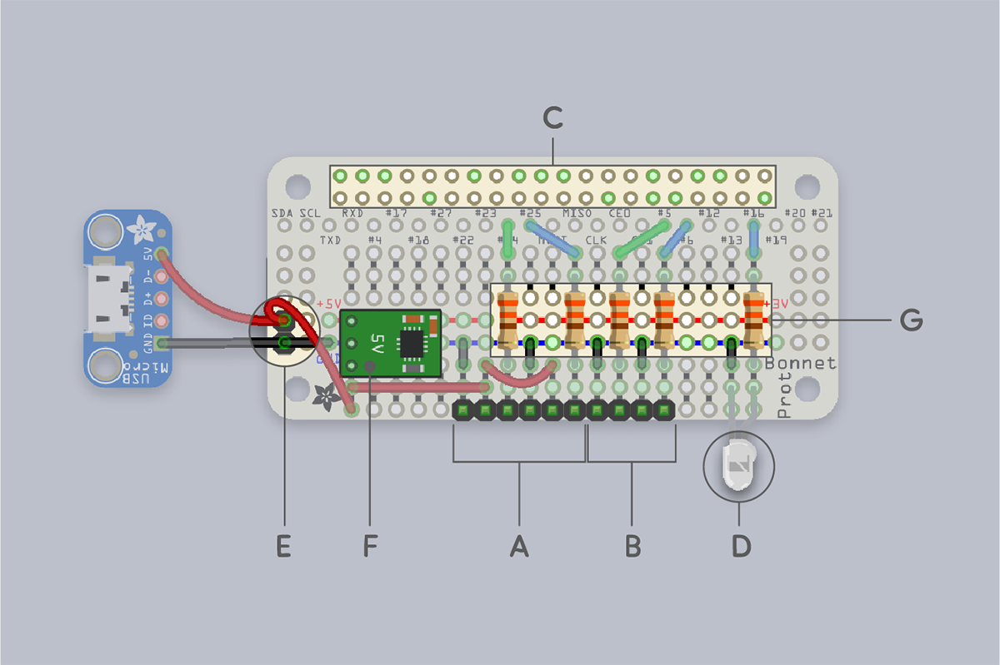
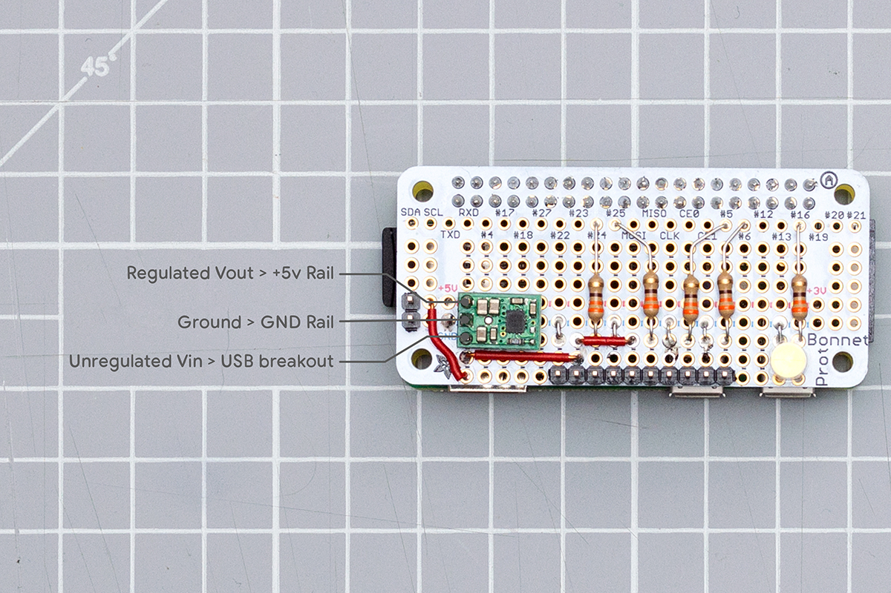
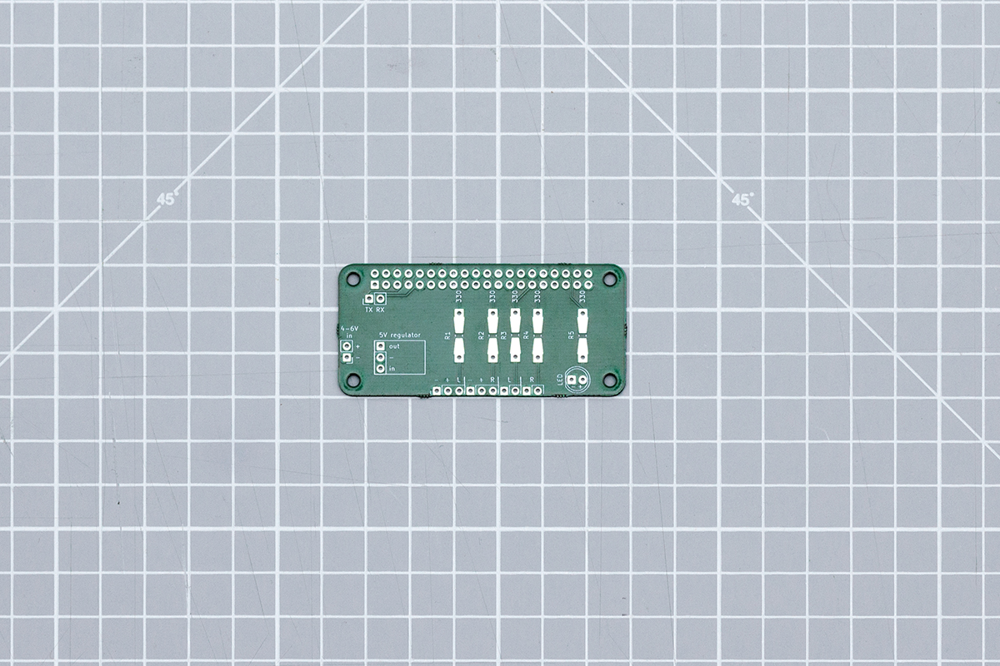
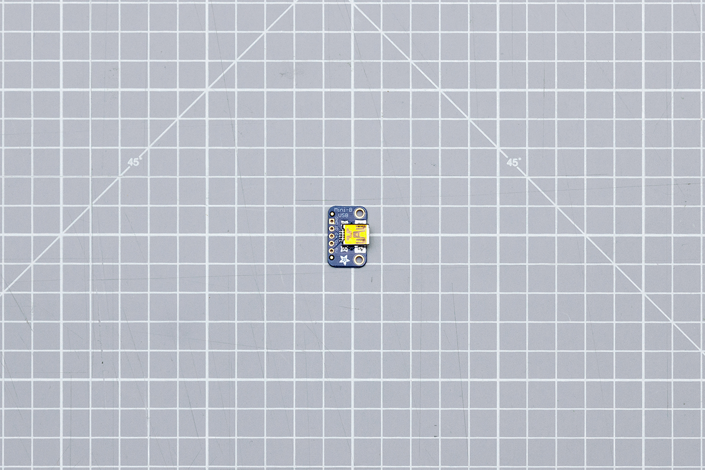
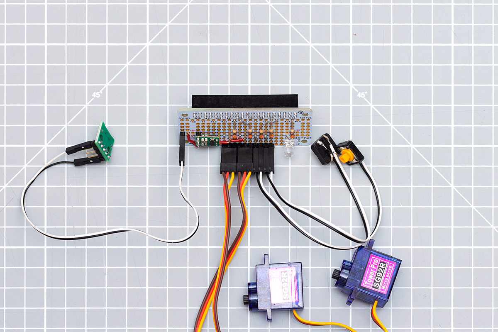
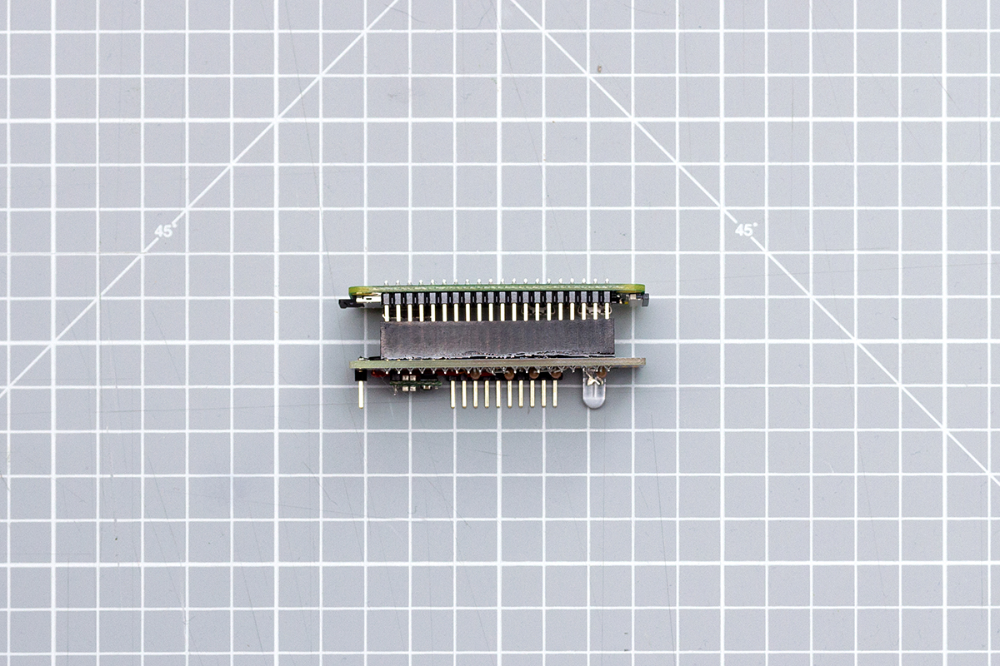
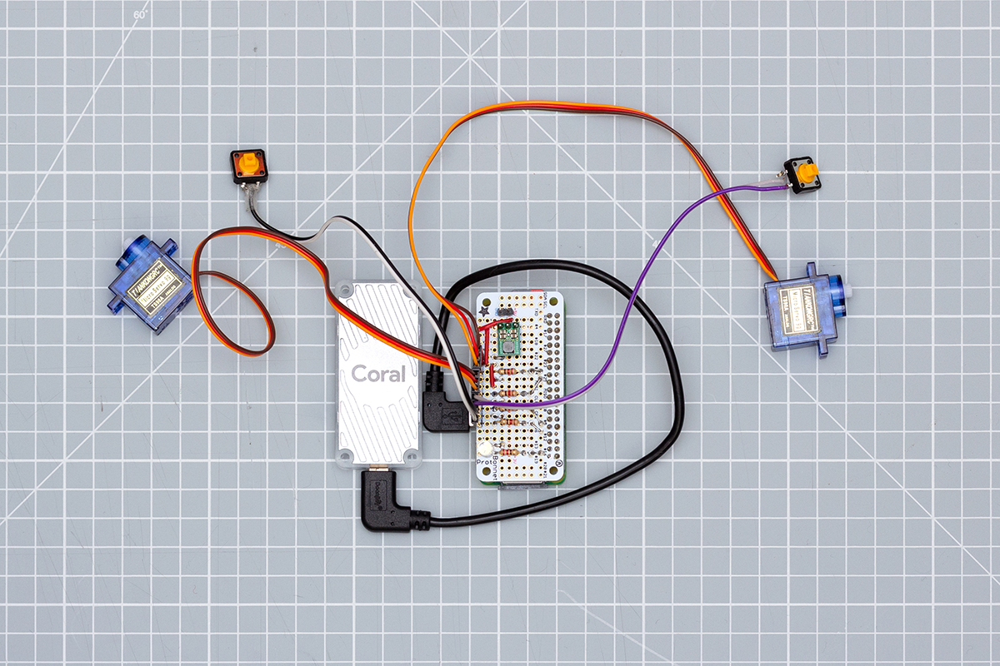

# 2.0 Build the electronics
 

This directory contains all of the source files needed to assemble the electronics for Alto. They are based around a single through-hole prototyping board which can be assembled easily by hand. This board connects to the GPIO pins of the Raspberry Pi Zero, and breaks out headers for the other component parts of Alto: two servos, two buttons, and an LED.

Each of these items are common and easy to get, or you might even have them in your making space already. Alternatively, they can easily be substituted for other parts, for example if you have different servos or LEDs available. 

The full list of components is available [here](electronics/alto-bom.xlsx) as a downloadable spreadsheet.

**Skills required**   
- Through hole soldering, reading a circuit diagram

**Time to complete**     
- 30-90 minutes (depending on your soldering experience)

**Tools you’ll need**     
- Soldering iron
- Solder 
- Wire strippers
- Optional: helping hand, solder tip cleaner, multimeter, heat proof mat 
 

 
 

## Two approaches

There are two approaches to creating the electronics for Alto: 
1. using a protoboard 
2. using PCBs

If you're only building one or two Altos, hand assembly with a protoboard is probably the simplest way to approach the construction. If you are assembling more than a couple of units, you may wish to consider getting some PCBs created.

Either approach will use the same set of components that are listed in the [bill of materials](electronics/alto-bom.xlsx) (BOM) spreadsheet. 
 

### Option 1: Protoboard

The simplest approach to constructing an Alto unit is to use protoboard. All of the components used are through-hole and easily soldered by hand. The remote components (buttons and servos) are connected to headers on the protoboard, which itself is connected to the GPIO header on the Raspberry Pi Zero.

The image below shows the different connectors and functionality of the protoboard:

- (A) Servo connectors – six header pins for connecting the two servos that control Alto‘s arms
- (B) Button connectors - four header pins for connecting the left and right side buttons
- (C) GPIO header - here you will need to solder on a 40 pin female header connector to connect your protoboard to the Raspberry Pi Zero’s GPIO male header
- (D) Status LED - a single LED which can be used for debugging your Alto build
- (E) Power input - two pin header for connecting power
- (F) Power regulator - a discrete subcircuit for ensuring smooth power delivery to the Raspberry Pi Zero
- (G) Resistors - current limiting resistors to protect the GPIO pins

You can find the Fritzing file containing the wiring diagram you see above, [here](electronics/alto-proto-bonnet-unannotated.png). Make sure to follow the diagram carefully, paying particular attention to the orientation of the USB (labelled E) and power regulation (labelled F) PCBs. 

The power regulation PCB has three connections - Vout, Ground and Vin. The pin labelled VOUT should be connected facedown, to the red +5v rail of the protoboard. The middle ground pin on the power regulator should be connected to the GND rail of the protoboard. Leaving the Vin pin of the power regulator to be connected to the USB breakout on the protoboard as in the image below.

We have also provided a circuit diagram of the protoboard [here](electronics/kicad/alto.svg). 
 

### Option 2: PCB construction

If you want to assemble more than a couple of Alto units, you might want to consider having some PCBs fabricated. In this directory, you can find [kicad source files](electronics/kicad) and pre-exported [Gerber files](electronics/gerber). The assembly process for these boards is the same as the protoboard, and each connector is labelled in the PCB silkscreen.

As with the protoboard, you will need to solder on a 40 pin female header to connect the PCB to the Raspberry Pi Zero.

 
 

## Power options

The recommended way to power Alto is with the prefabricated USB power PCB circuitry specified in the BOM. This ensures smooth delivery of adequate power to Alto during normal operation.

The Raspberry Pi requires a tightly regulated 5V input. The current draw from the servos can mean the power supplied through a USB cable can fluctuate and isn’t appropriate to power the Raspberry Pi directly. Using the boost converter ensures a more stable delivery of power, and means we can accept a wider range of power sources - for example a 3.7V LiPO or 4x rechargeable AA batteries.

To use the suggested USB power circuitry, solder pin headers to the USB breakout board (if required) and then use two receptacle-receptacle jumper wires to connect the breakout to the protoboard or PCB. The first connection is between the ground pins, marked ‘GND’ on the breakout board and ‘-’ on the PCB. The second connection is between the positive pins, marked ‘5V’ on the breakout board and ‘+’ on the PCB.

Depending on your application, you can choose to power Alto by other means. Any alternative options should be carefully chosen to meet Alto’s power requirements. 

## Remote components

The buttons and servos used in alto are connected to the protoboard (or PCB) via leads as in the image below.

 You should use roughly 10cm of cable for each of these. Regardless of the construction method you are using, you will need to attach your servos and buttons to the headers on your board. 

When you start to build the casing for your alto, you will find that the remote components are inserted into the housing before your Raspberry Pi, Coral and protoboard/PCB. We recommend preparing your ‘stack’ of electronics, before you begin to assemble the cardboard housing.

To test your electronics are working, connect them in this order:
1. Connect your Coral to the port labelled ‘USB’ on the Raspberry Pi
2. Attach the camera ribbon cable to the ribbon port on the Pi, making sure that the copper contacts are face down.
3. Gently press the port’s black clip in to secure the cable.
4. Using the soldered header pins, connect your protoboard/PCB to the Raspberry Pi as in the two images below.
5. Temporarily, connect your servos and buttons as shown in the illustrated PCB diagram shown previously.
6. Lastly, plug in your power source and turn it on.

 

After a few seconds, you should see the LED status light on your board turn on, and you can test the circuitry.

 
 

## LED status codes

On the Alto PCB there is a single LED which is used to communicate various status messages to help with debugging in case of error. These are as follows:

- Constantly on - no error, Alto is running as expected
- Two-flash blinks - the camera is connected incorrectly
- Three-flash blinks - the EdgeTPU is not detected

 
 

## :tada: Woohoo! You've finished this section :tada:

If you’ve completed all the steps above, you should now have a functional set of Alto electronics.

Before proceeding any further you might want to take a moment to make sure that everything is working as expected. Check that all connectors are connected as they should be (except the power connector) and that all solder joints look properly formed.

If everything looks good, plug in your appropriate power source. It will take between 15 and 30 seconds to boot Alto, depending on the speed of your SD card.

When Alto has finished booting, try teaching it something with one of the buttons. You want to make sure that all elements of Alto work properly before proceeding with assembly: learning on both sides; recognising on both sides; and forgetting.

If you have any errors, you can go back a step to check your software setup, or look back over the steps in this section to troubleshoot your electronics. 
 

## Next section &#8594; [3.1: Making the electronics casing](3.1-Making-the-electronics-casing.md)
