# 3.1 Making the electronics casing 
 

This directory contains all of the source files you will need to construct the inner part of Alto’s casing. They’re provided as a starting point, but feel free to explore the designs and modify them for your own needs.

If you’re in the process of building Alto and have not yet set up your Raspberry Pi or built and prepared your electronics, we recommend you start with those first.

**Skills required**

- Accurate craft skills - cutting, sticking and folding

**Time to complete**
- 45min - 1hour

**What you’ll need**
- 2mm Cardboard (flute E)
- White card (300 gsm)
- Printer and paper
- Craft knife
- Stapler
- Metal rule
- Glue stick
- Bone folder (or a coin)
- Optional: Coloured card (blue, red, yellow)
 
 

## About the templates

- [alto-paper-templates.pdf](casing/alto-paper-templates.pdf)
- [alto-paper-templates.ai](casing/alto-paper-templates.ai)

Templates for the case design are provided above in both PDF and Adobe Illustrator format. Before you begin the step by step assembly, download the PDF and print it on white paper at 100% scale, making sure they aren’t scaled to fit the paper.

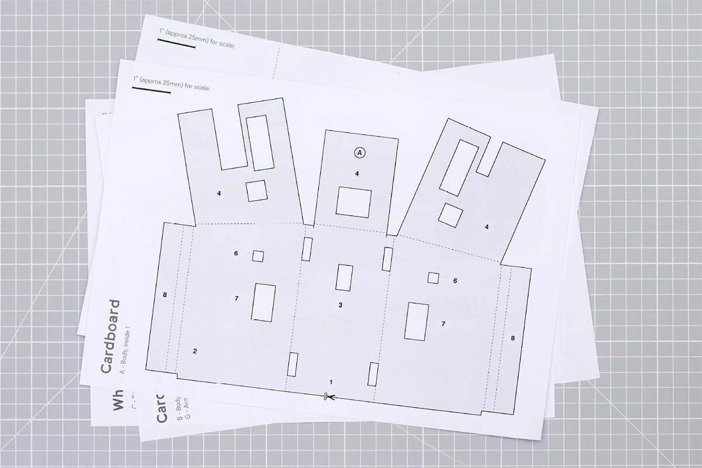

:fire: Hot tip! You may use the Illustrator file if you wish to change the dimensions of Alto, or even prepare the document for laser cutting. The different cuts, folds, and texts have been separated into layers for easy conversion to DXF for laser cutting. Remember that you will have to calibrate your laser cutter to work with the materials you have chosen.

:warning: WARNING: this tutorial requires use of sharp tools such as craft knives. Please take care when using these tools, and supervise younger makers 
 
 

## Step by step assembly

1. Roughly cut out all your template pieces (A-G). Then:
- Glue (A), (B) and (G) onto 2mm cardboard
- Glue (C) onto thin white card
- Glue (D) onto thin blue card
- Glue (E) onto thin yellow card
- Glue (F) onto thin red card

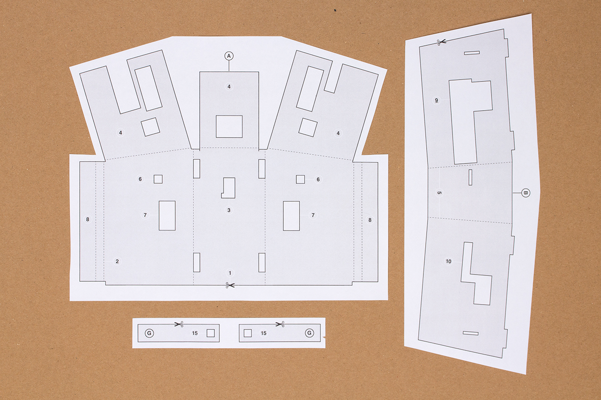
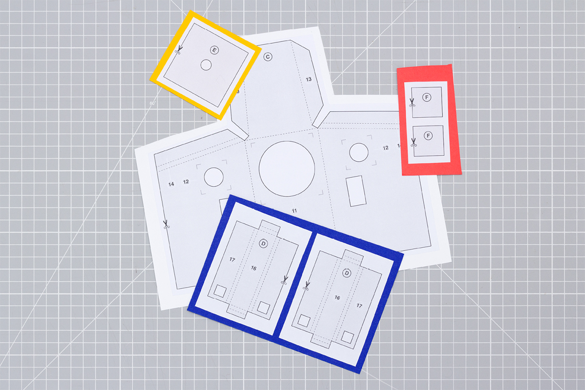 
 

2. Using the craft knife, cut out the pieces (A - G) along their thick black lines. We recommend starting with the cuts in the middle of the templates first, and doing the outside edges last.

:fire: Hot tip! With cardboard we recommend scoring lightly at first, and then doing a second cut to slice all the way through.

 
 

3. Press firmly along all the fold lines using a blunt object like a bone folder or the edge of a coin. Then prefold (inwards) along all those edges to make the assembly easier.

:fire: Hot tip! Score very lightly on the fold line to help you make the fold in exactly the right place.

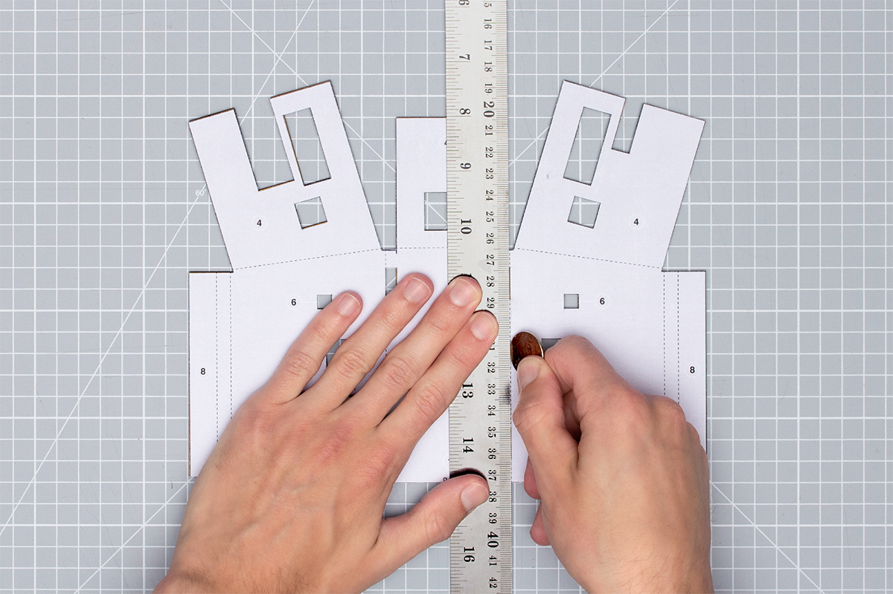 
 

4. Place the camera module carefully on (A) with the lens face down in the cavity labelled (3). Gently thread the ribbon cable through the hole above it as shown.

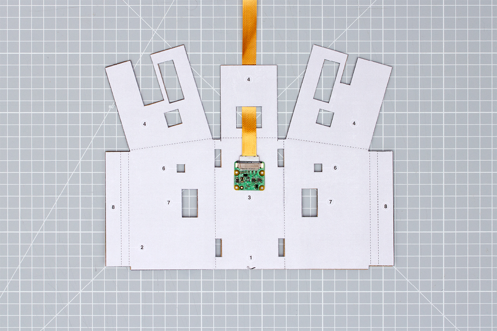 
 

5. Fold the tabs labelled (4) down and secure them in place by stapling the edges down.

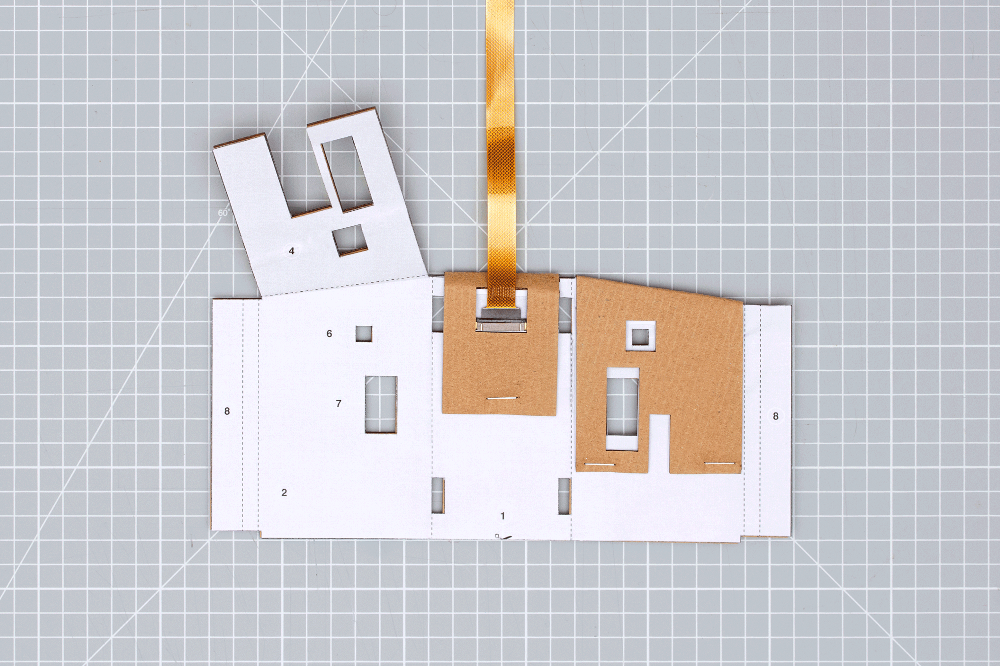 
 

6. Take one of your buttons and snip off the unused legs. Press the button firmly into the cavity labelled (6), ensuring the cables are on the top side.

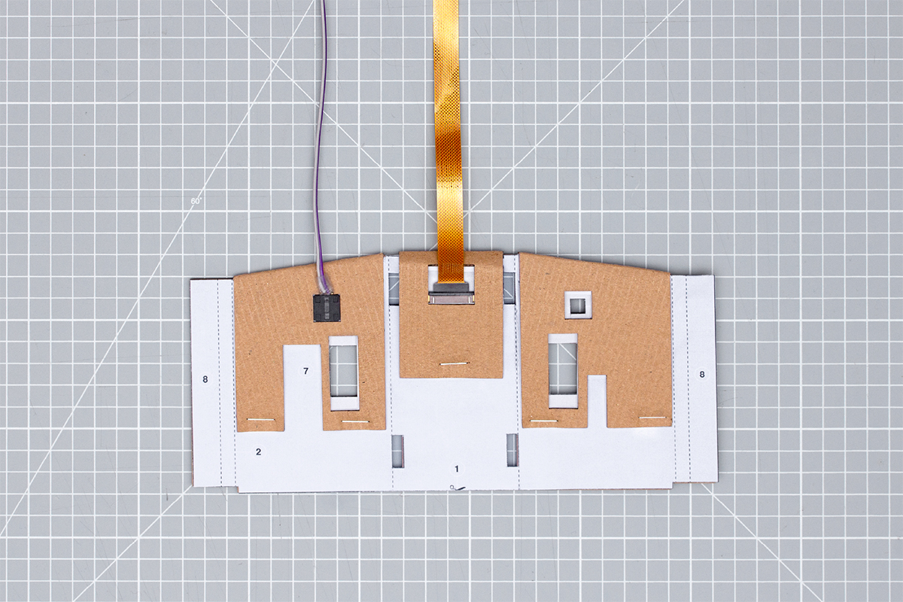 
 

7. Now do the same with your servo motor, into the cavities labelled (7).

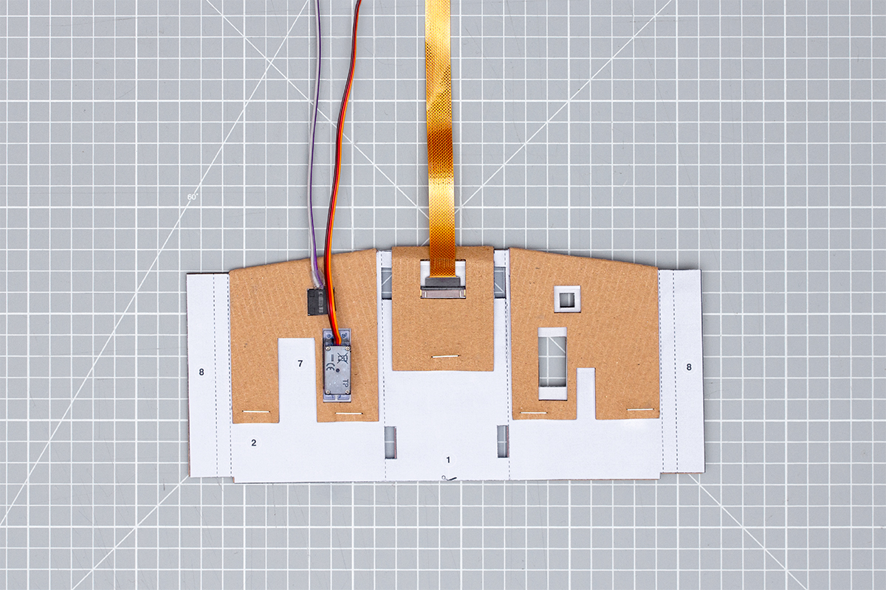 
 

8. Slot part (B) into (A) as shown, and thread the button and servo cables through their holes on (B). Then carefully fold up Alto’s side panel, ensuring the electronics are still in their place.

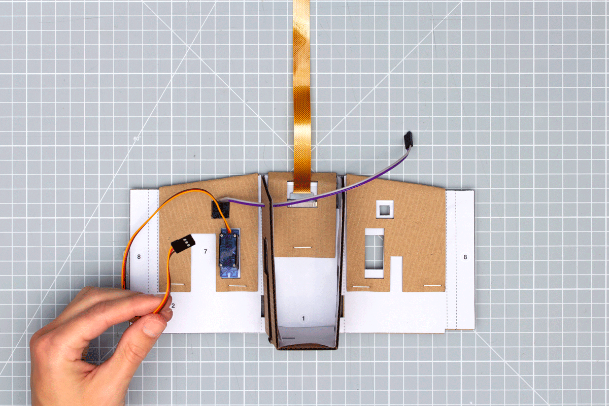 
 

9. Holding everything tightly together, fold in the wing labelled (8) on part (B). Make sure it wraps around to the inside of Alto and use a stapler along the inside face to ensure it’s secure.

:fire: Hot tip! If your staples aren’t long enough, try stapling from the outside face in addition to the inside face.

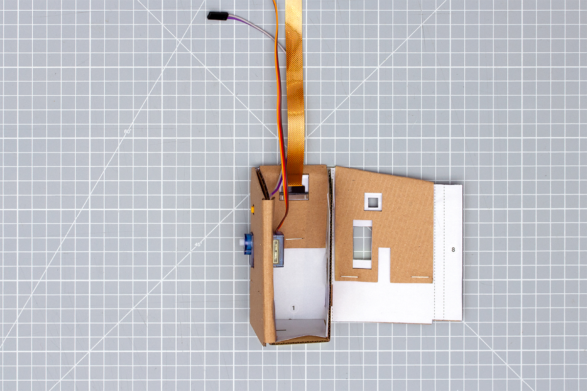 
 

10. Then repeat steps 6-9 on Alto’s other side.

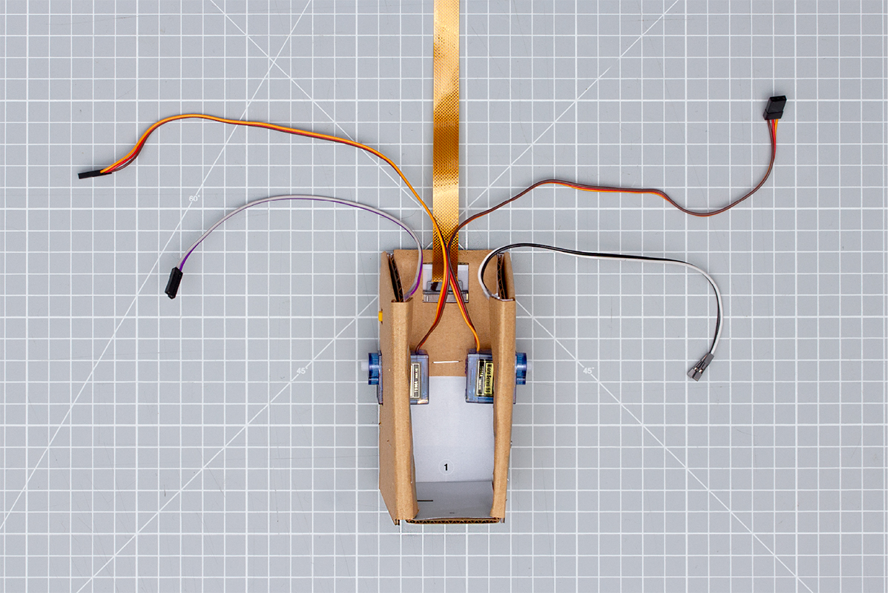 
 

11. With your cable on the right hand side, slip your stack into Alto from the top. The Pi and protoboard should fit snugly into the cavity labelled (9), allowing access to the SD card slot from underneath Alto. The right-angled cable should then fit into the cavity labelled (10).

 
 

12. Place your Coral USB Accelerator down behind your servos so that you still have access to your headers.

 
 

13. Using the diagram below, connect your cables up to your protoboard headers, making sure you haven’t mixed up the left and right side buttons and servos. Attach the Pi camera ribbon cable to the Raspberry Pi connector, with the copper pins facing the PCB. 

:warning: Careful: the ribbon cable is very delicate, so try to avoid folding, twisting or creasing it as much as possible.

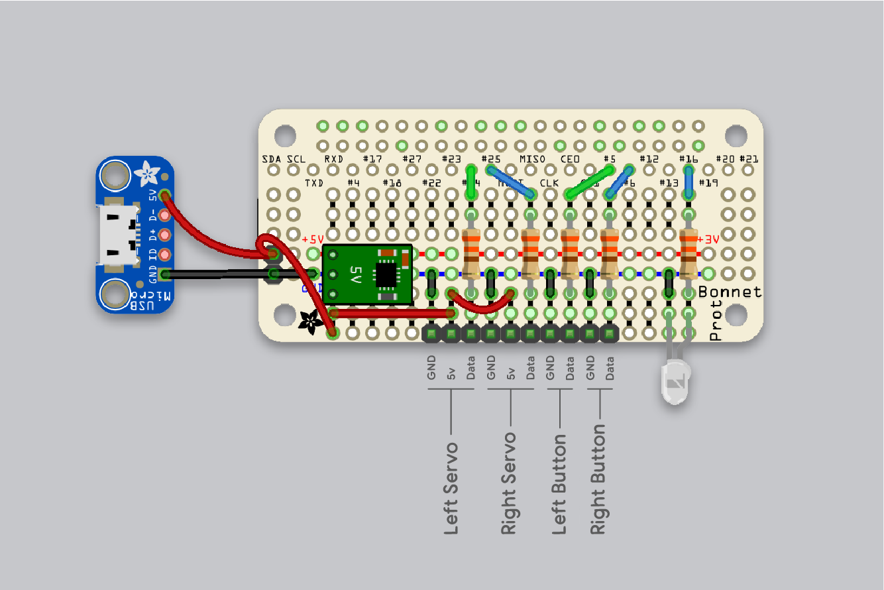 
 

14. Once you've connected all your cables, you should have something that looks like the image below. Try and tuck the cables in around the electronics, but be careful not to disconnect anything. Don't worry too much if you still have some stray cables, as these will be held in place once you put on Alto's outer case.

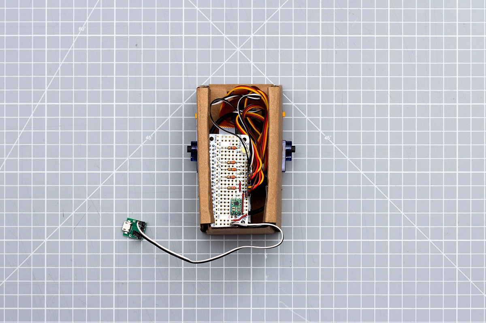 
 

## :tada: Woohoo! You've finished this section :tada:

If you’ve completed all the steps above, Alto should be starting to take shape. All the electronics should now be safely housed in the brown cardboard casing, and waiting for the final exterior card case and arms.

Before going further you might want to take a moment to make sure that everything is still working as it should. It's common for jumper wires to come loose, or poor solder joints to be exposed during the process of housing the electronics. Remember, the camera cable is particularly delicate.

If things aren’t working, start by checking all your connections. If they all look good, go back to the software or electronics sections to double check you completed them before going further. 
 

## Next section &#8594; [3.2: Making Alto's outer case](3.2-Making-altos-outer-shell.md)