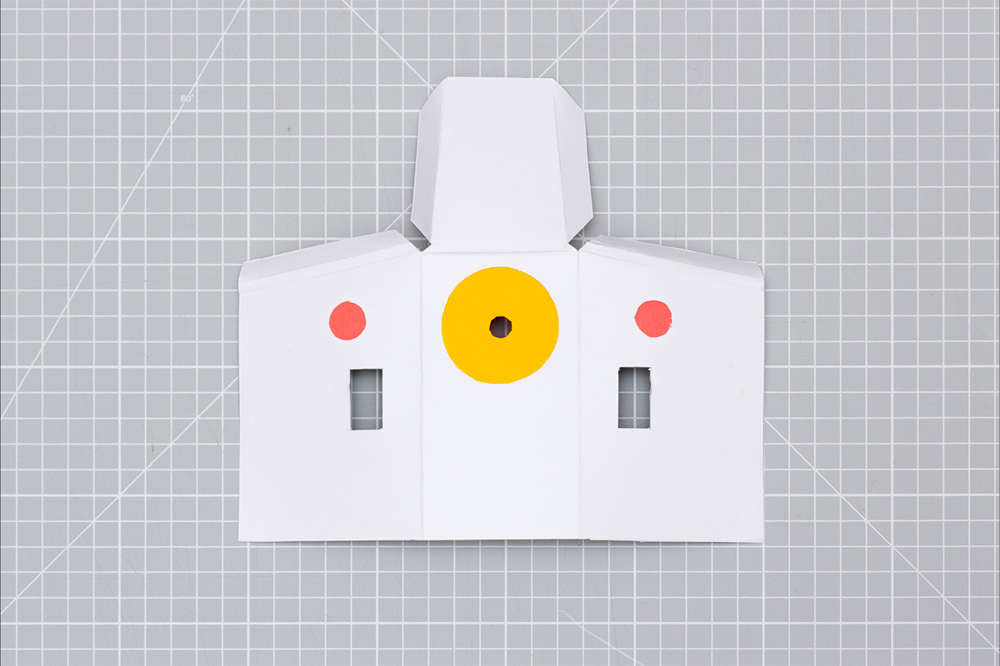
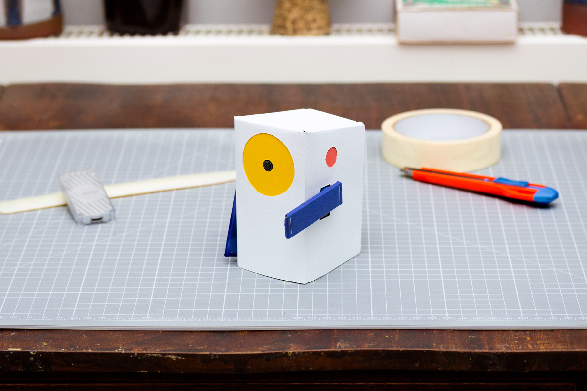

# 3.2 Making Alto's outer casing 
 

In this section, we’ll be adding some character to Alto by creating the outer shell. In addition to giving Alto some personality, this outer layer helps contain the electronics, and keep the inner card structure more secure.

By the end of this section, you’ll have finished your build, and have a fully functional Alto!

**Skills required**
- Accurate craft skills: cutting, sticking and folding

**Time to complete**
- 45min - 1hour

**What you’ll need**
- 2mm Cardboard (flute E)
- White card (300 gsm)
- Printer and paper
- Craft knife
- Stapler
- Metal rule
- Glue stick
- Bone folder (or a coin)
- Optional: Coloured card (blue, red, yellow)
 
 

## Assembling your outer case

15. Next we are creating Alto’s outer shell, starting by taking the coloured elements we made in Section 3.1 and glue them to the main body (labeled part C on your print out).
- Glue Alto’s yellow eye (E) onto the part labelled (11)
- Glue its red ears (F) onto the part, labelled (12)

 
 

16. Place cardboard Alto face down, in the middle of part (C).
- Fold the top part of (C) downwards, slipping the tabs labelled (13) between the layers of cardboard
- Then fold in the sides of (C), doing the same as before with the tabs labelled (14).

:fire: Hot tip: make sure the white card folds are as tightly creased as possible so that Alto’s edges are crisp - this will also help hold all the faces together.

 
 

17. To make Alto’s arms, start by taking the white plastic arm from your Servo motor kit, and inserting it into the cavity (15) on part (G). Then carefully staple through the arm and the cardboard to secure them together.

 
 

18. Place the cardboard arm onto the face labelled (16) on (D), with the stapled white servo arm face down. Then fold in all the tabs, with the face labelled (17) last, and staple the two ends to secure the card around the cardboard.

 
 

19. Now do the same with the second arm. When ready, press Alto’s arms onto the servo shafts. This should be a push fit, however you can use the screws that came with the Servo motor if you would like to make them more secure.

:fire: Hot tip: when you first power Alto on, the servo motors naturally return to their zero position (arms down). If Alto’s arms are out of position, pop them off and put them back on so that they are down by its side.

 
 

20. Connect the servo and button cables as in [Section 2: Build the electronics](2.0-Build-the-electronics.md), then plug Alto into your power source, and you’re done!

 
 

## :tada: Woohoo! You've finished this section :tada:

If you’ve completed all the steps above, you should now have a fully functional Alto, complete with housing. Congratulations!

Start playing with Alto to test your build and better understand how the system works. If things don’t behave as expected, go back through the build steps to see where things went wrong. If you want a more structured guide for using Alto, take a look at the [‘Experiment with Alto’](4.0-experiments-with-alto.md) section of this repo.

If you’re feeling adventurous, why not try hacking Alto to do different things, or simply experiment with the casing design. You can see some examples of how we have remixed Alto [here](5.0-remixing-alto.md). If you come up with any cool edits, share them online to inspire others. Or submit a project to the [Experiments with Google site](https://experiments.withgoogle.com/) if you find a completely new way of using the Coral USB Accelerator. 
 

## :star: Bonus section &#8594; [Remixing Alto](5.0-remixing-alto.md) :star:
