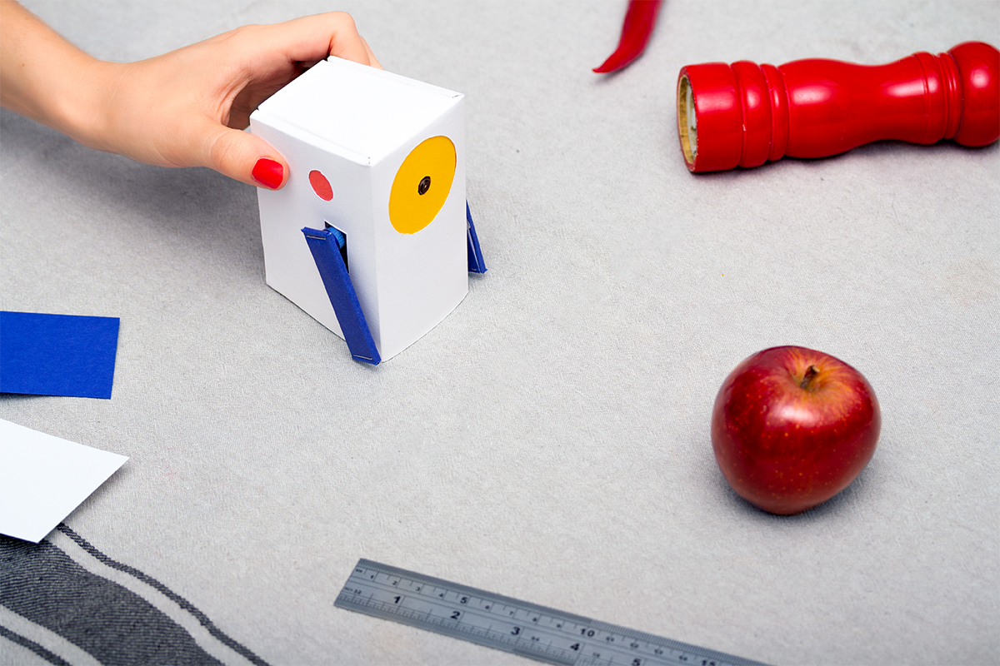
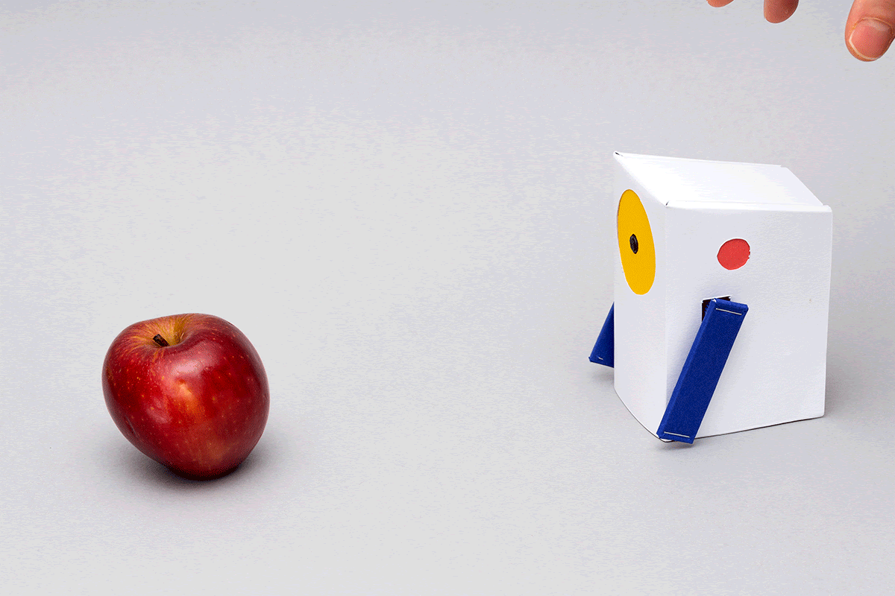
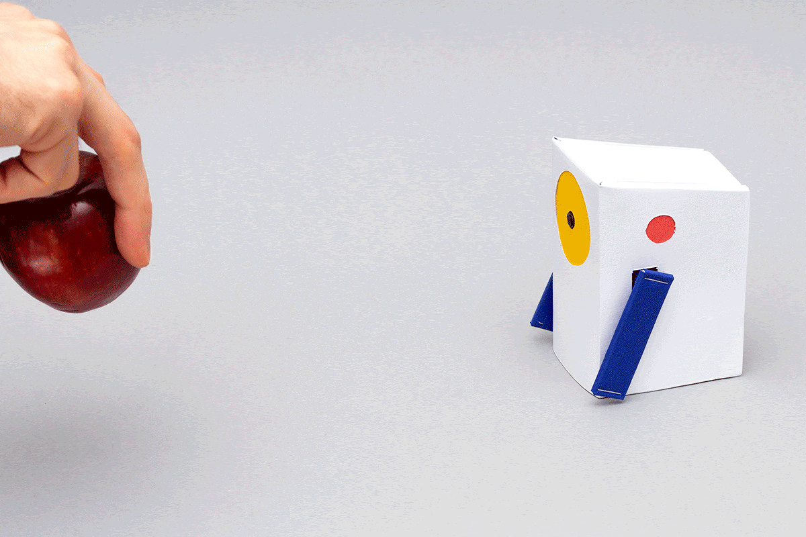
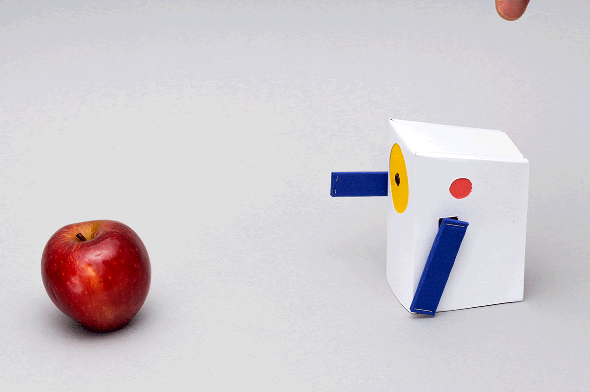
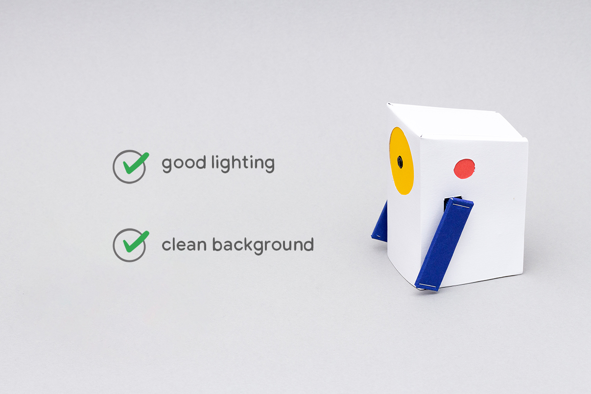
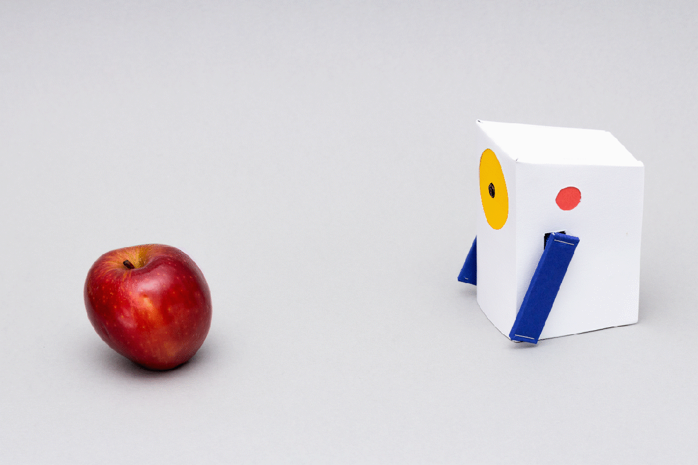
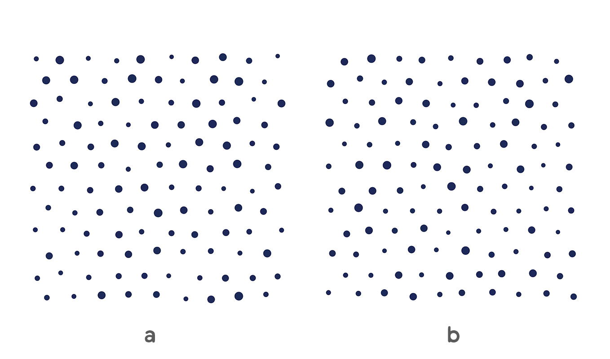
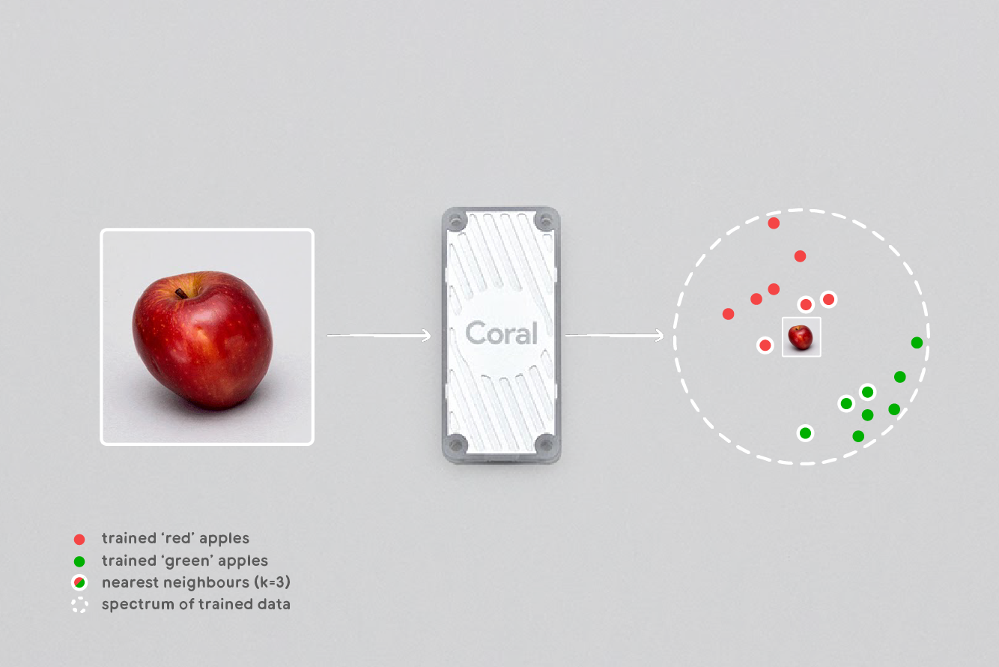

# Experiment with Alto  
 

 
 

## Understanding Alto

This document contains a number of experiments to help understand how Alto works, and how you can use Alto to introduce some of the basic concepts of machine learning to others. 

Alto is a simple (and fun!) way to understand these concepts. The more you use Alto, the better you will understand the capabilities—and limitations—of machine learning. If you’ve already built your Alto, you can use it directly with the activities in this document. If you haven’t built your Alto yet, you should [go back](1.0-Set-up-the-software.md) and do that first. 

This document is split into two sections:
1. [Learning by doing](#learning-by-doing) - a range of simple, hands-on experiments that show you how to operate Alto, and illustrate some of the basic concepts of machine learning.

2. [Under the hood](#under-the-hood-how-alto-works) - a more indepth look at some of the more technical details of Alto, and an illustration of what's happening under the hood.
 

## Learning by doing

### Operating Alto

In this section, we recap Alto’s controls, by completing the simple process of teaching Alto to recognise an object, testing that Alto can recognise what you’ve taught it, and erasing Alto’s memory to start again afresh.

There are three basic things that you can do with Alto:

- [Teaching](#teaching)
- [Recognising](#recognising)
- [Forgetting](#forgetting)
 
 

### Teaching

Teaching Alto is very easy: 

1. Choose your object and place it in front of Alto, facing the camera. 
2. Press one of the buttons on the side of Alto to start the teaching process. While it’s learning, Alto will slowly raise the arm on the same side of the button that you pushed. Alto uses the camera to take 40 sample pictures of the object to learn about it. 
3. When Alto’s arm has reached roughly 90º, the teaching process has finished, and Alto is ready to recognise what it’s learned.

 
 

### Recognising

As soon as the teaching process has finished, Alto automatically enters recognition mode. There’s no user input needed for Alto to begin evaluating the things it sees: if something is recognised by Alto, it will point with the corresponding arm. For example if you placed a red apple in front of Alto during teaching, it will raise the corresponding arm when the red apple is placed in front of it again in recognition mode. 

 
 

### Forgetting

If you want to teach Alto something new, you can clear everything it's been taught by holding down both buttons simultaneously for 3 seconds. This will clear the memory of everything you have taught Alto on both sides.

 
 

## Experiment One: simple object recognition

The first experiment covers the basics of how you can use Alto to recognise an object, and how to set up your teaching environment to get the best results.

 
 

### Teaching Alto to recognise an object

As we’ve already seen in the [operating Alto](#Operating-Alto) section, you can teach Alto to recognise what it sees using the buttons on either side.

Alto will work best in a location with good lighting and a plain background. This can help ensure its camera can capture the object you want it to recognise clearly. When you’ve found your spot, place Alto down and power it on.

 
 

Next, choose an object and place it in front of Alto. We’ve chosen this shiny red apple. 

To start teaching Alto, press one of the side buttons; Alto will learn about the object it sees by taking pictures of it.

As we’ve seen before, when Alto has finished learning (when it has fully lifted its arm to 90°) , it automatically switches to recognition mode. Now, everytime Alto sees the red apple, it will point at it.

Well done, you’ve just completed your first machine teaching experiment! Easy! 
 

### Other things to try

You can wipe Alto’s memory to start again and teach it about a new object. Try exploring different objects to teach to Alto. Do they all work equally well? 

Try experimenting with different setups to teach Alto - change how close or how far the object is from Alto when you teach, and when Alto is recognising. Try teaching Alto in different environments, with different lighting and backgrounds. What does Alto’s behaviour tell you about the teaching and recognising process? 
 

### Bonus: Pattern recognition

By now, you should have been able to get Alto to recognise a variety of different objects. This is great, but you might be wondering what Alto can do beyond recognising apples and bananas. 

In addition to objects (that humans find easy to recognise), Alto can also remember quite complex things that might be much harder for us to see.

Look at the two patterns below. At first glance, they look the same, but looking closer, you might be able to tell that they are both in fact slightly different. 

In this experiment, we’ll test Alto’s memory against a real person, to see who’s better at accurately remembering a chosen pattern. Who do you think will be able to remember the correct pattern more easily and why? 

First, find a partner to help with this experiment. Next, print out the [patterns](extras/alto-lessons-test.pdf), and teach both of them to Alto three or four times - one side for each pattern. Then show the patterns to your partner, making sure to cover the labels. To make it fair, show them to your partner for the same amount of time you showed it to Alto. And be sure you always show it to Alto (and your partner) in the same orientation that you used to teach it.

Shuffle the patterns and then time how long it takes both Alto and your partner to identify the right pattern.

So, who did better? Is this what you predicted? Why do you think this might have been the case?

After completing these experiments, you’ve started your journey into machine learning! Although the process is simple, the things you’ve learnt form the basis of how Alto works in any situation - teach, recognise, forget. 

We’ve seen that Alto can recognise different objects and even quite complex patterns, but can also get things wrong that seem obvious to us. Why might this be? 
 

## Experiment Two: recognising two things

In the previous experiment, we learnt how to teach Alto to recognise and then recall one object. In this experiment, we’ll go a step further to show how Alto can be taught to remember two different objects simultaneously.

 
 

### Teaching Alto about two things

For this experiment, you’ll need two objects that are visually different. We’re using a red apple and a banana.

 
 

Start by clearing Alto’s memory to erase anything that might be there already. 

Once that’s done, teach Alto about one of your objects. As before, once completed, Alto should now recognise that item. Check that it can recognise the object as you’d expect before moving on.

Now it’s time to teach Alto about a second object. Keeping Alto in the same place, replace the first object with the second one. Then use the button on the other side of Alto to teach it about this new object. This time, Alto will point with its other arm.

You should now be able to alternate between the two objects, and Alto should be able to recognise each one. In our case, Alto can now tell the difference between red apples and bananas! 
 

### Other things to try

This is a simple experiment, but the ability to distinguish between objects can be used in many applications. In industry, you might need a similar system to separate different types of products in a factory, or you might just want to sort out the [marshmallows from your cereal](https://coral.ai/projects/teachable-sorter/).

Try exploring different objects for Alto to distinguish between. What sort of things can Alto easily distinguish, and what objects does it mix up? Why might this be, and how could you adjust your teaching process to get better results? 
 

## Experiment Three: adding more data

So far, you’ve seen how Alto can very simply, and quickly be taught to recognise objects on each side. In this experiment, you’ll explore how to teach Alto about these objects multiple times, to improve Alto’s ability to recognise them. 

This practice of multiple teaching cycles will also introduce us to the ideas of ‘bias’ and ‘confidence’ within machine learning.

 
 

### Adding more data

As you might have seen in the previous experiments, it can be hard to remember something clearly if you haven’t seen it for very long, or from only one perspective. Like all of us, Alto can remember something better the more you teach it about it.

To teach Alto about something multiple times, you simply follow the same teaching process already covered, but don't wipe Alto’s memory in between times. 

With each new teaching process, you’re adding data to Alto to help it recognise what it captures with its camera. It's important to remember which side you’re teaching Alto on, so that you don't mix up the data. 

So why might you want to do this? 

In some of the previous examples, you might have seen times where Alto doesn’t immediately recognise something you’ve already taught it. There are lots of reasons why this might happen, but one common one might be because the object is in a different position to when you first taught Alto. 

Alto can only remember what it's been shown. This is an important point to remember. If we shift our example object from apples to mugs, we can test this idea out. 

We know we can easily teach Alto to recognise a mug by following the same process we did previously.

 
 

But if we turn this mug on its side, Alto doesn’t recognise it anymore. Even though it's the same object, Alto has never seen it from this angle, and has never been taught it's the same mug. This is something that we can do very easily, but learning machines like Alto can struggle with without more training.

For Alto to recognise this as the same mug, it needs to be taught with more images of the mug at these different angles to give it more information. 

If we teach Alto again on the same side, with the mug in this position, Alto should now recognise the mug when it's standing upright or on its side.

You can repeat this process as many times as you like, from different angles or distances. The more you teach, the better Alto should be at recognising the mug in lots of different positions. This can also be a useful feature to help Alto distinguish between two similar objects.

### Other things to try

In experiment two, we saw how you can teach Alto about two different objects. You might have found that Alto sometimes struggled to tell similar objects apart. Try picking two objects that look similar, and teach Alto about them both - one on each side. Next, try adding more data to each side, by teaching Alto about the objects multiple times. 

Does Alto get more reliable at telling them apart as you add more data? 
 

### Bias in machine learning

We’ve seen that adding more data by teaching multiple times can help Alto recognise objects more successfully. This can be a very useful feature, but it can also lead to a potential problem: bias.

Put simply, it's important to try and balance the amount of learning Alto does on each side. For example, If you teach Alto to recognise red apples 10 times, but only teach Alto to recognise green apples once, it will likely be much better at recognising red apples than green ones. Here we would say Alto was biased towards red apples. You can try this out yourself. 
 

## Experiment Four: teaching Alto about classes

So far, you’ve seen how Alto can be taught to recognise specific objects. But Alto can also be taught to recognise types of objects, called classes.

Thinking again about our red apples and bananas example, we’ve already seen that it's easy to teach Alto to recognise one specific red apple and yellow banana. We’ve even shown how we can teach Alto about these fruit multiple times, so it can recognise them from any angle.

But imagine we were trying to build a machine to sort between red and yellow objects in general. In this case, it's not much good if Alto can only recognise these two specific fruit. We need a system that lets Alto distinguish between other types of objects that are these colors.

One way to do this is to use Alto’s two buttons to teach it two different classes of objects - red ones and yellow ones. This uses the same process we’ve covered when teaching Alto multiple times on each side.

To try this out, 
1. Gather as many red and yellow objects as you can find. 
2. Set Alto up for teaching as normal.
3. Pick one side to be your red class, and the other to be your yellow class (you might want to make a note of which is which)
4. Go through the teaching process as normal for each object, remembering to teach Alto on all the red objects on one side, and all the yellow ones on the other.

You’ve now created two classes for Alto to recognise! See if it’s worked by putting the various objects in front of Alto and checking which arm is pointing. 
 

### Generalising

Creating classes with Alto lets you use many more objects at once, but so far we’ve still been limited to the objects we have at hand to teach Alto with. The red/yellow sorter we just made is great, but what if you wanted Alto to be able to distinguish between any red or yellow object? 

We can’t teach Alto about every possible red or yellow object, so we need to teach it about lots of different red and yellow objects—so many that when it sees a red or yellow object it hasn’t seen before, it can recognise that too. 

To try this out, find a new red or yellow object that hasn’t been used to teach Alto. Depending on the amount of data you’ve used to make your classes, Alto might be able to correctly classify this object already.

If not, try teaching Alto more about the objects you have, or find other red/yellow objects to add to the class. Can you give Alto enough data to get a successful classification for an object it hasn’t seen before? 
 

## Under the hood: How Alto works

In this section we’ll take a look under the hood of Alto, to understand a bit more about how it works. The world of machine learning and image understanding is vast! This isn’t a comprehensive guide to either of these topics, but rather a more detailed look at Alto in particular.

If it peaks your curiosity about machine learning more broadly, there are many wonderful introductory guides online, including a [crash course from Google](https://developers.google.com/machine-learning/crash-course/ml-intro). 
 

### What Alto 'sees'

Alto uses the Raspberry Pi camera to take images of the world, which it uses to classify the objects that it can see. Although we use terms like ‘seeing’ and ‘remembering’ it's important to understand that Alto interprets the world very differently to us.

Alto sees things as a grid of pixels. Except, to Alto, a pixel is just an array of numbers representing red, green, and blue color values. When you teach Alto about an object, it uses its camera to take lots of photographs, looking for patterns in those pixels. But it doesn’t have any understanding of what that object actually is, it just runs the color values through a lot of math equations, making its decision based on a long sequence of mathematic results. That’s why we can sometimes get unexpected outcomes, with Alto struggling to distinguish between things that seem obvious to us. 
 

### How Alto recognises images (advanced)

When you press one of Alto’s buttons, you’re teaching it an example of what to classify as either left or right. Each example image is processed through a neural network on the Coral Edge TPU, to create a numerical representation (a vector), which is then added to the corresponding set.

 
 

After the teaching process has finished, Alto starts streaming images from the camera, trying to classify them into either the left or right set. Each image is processed through the same neural network to create its vector. This is then compared to every stored vector in the left set to determine how closely it matches anything it was trained on. Alto uses a [k-NN (k-nearest neighbours)](https://coral.ai/projects/teachable-machine/#k-nearest-neighbors) algorithm to give a match confidence based on the top closest results on that side. 

This process is then repeated for the right side. If confidence is high enough on either side then Alto will point using the side with the highest confidence.
