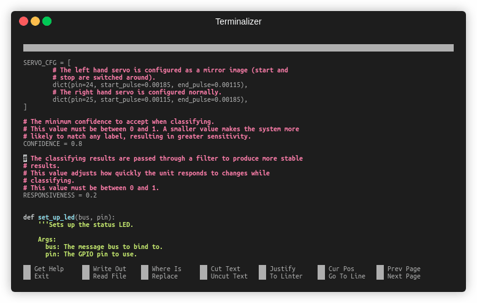
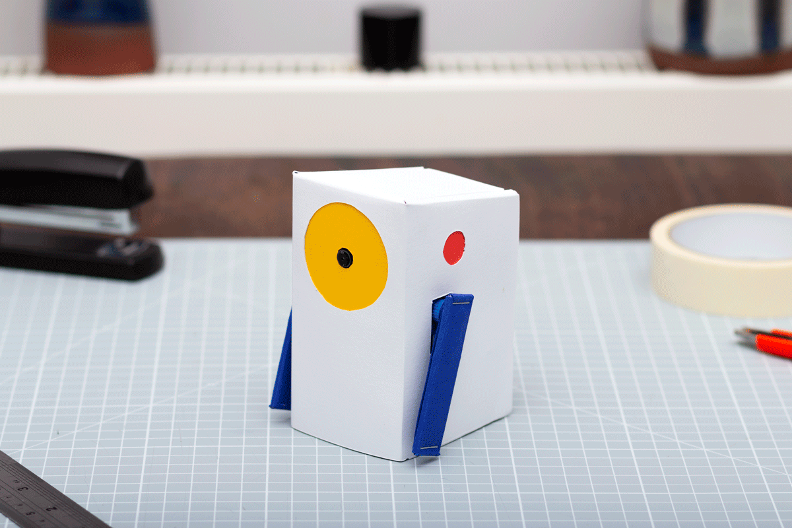

# Bonus: Remixing Alto 
 

Alto has been designed specifically with hacking and remixing in mind. There are countless ways to personalise your Alto; from simple visual tweaks, to complete component overhauls. This guide briefly shows some of the ways you might want to remix your Alto, but don’t stop there. Explore the examples and find completely new ways to remix Alto for your projects.

## Hacking Alto's software

With Alto’s code being written in Python, it's easy to add or change how Alto behaves. There are countless tweaks you might want to make to Alto’s code for your own projects - one might be to adjust Alto’s confidence value which controls if Alto makes a classification or not.

The value controlling Alto’s confidence is CONFIDENCE which can be found in the [alto.py](app/alto.py) file. This variable can be set to any float value between 0 and 1, with higher values requiring Alto to be more confident about a classification and pointing its arm.

Of course this is just the start of what can be done. Get creative and explore how altering the code can change how Alto responds when it recognises something. Many Python tutorials are available online to help get you started. 
 

## Hacking Alto's hardware

Alto’s arms not giving you the output you need? No problem! Using the GPIO pins on the Raspberry Pi and coding in Python, it’s easy to completely change the components used to give Alto completely new forms of expression.

In this example, we’ve added an LED ring to Alto’s front face and programmed it to illustrate Alto’s confidence score when evaluating objects. 

Get creative with output components for Alto. Remember that whenever you change components, you should make sure you have an adequate power supply and any additional control circuitry you might need. With new hardware, you might also need to redesign your card casing. 
 

## Hacking Alto's casing
The most straightforward way to remix Alto for your own projects is to modify the casing design.

Try new colours and materials for Alto’s outer casing that work for you and your project. Here are a few of our favourite examples of how people have given Alto radically different looks:

 
 

If you want to go further, you can even re-design the cardboard nets to change the shape of Alto. By editing the .ai file, you can adjust the size and shape of Alto to fit any application.

 
 

If you have access to other fabrication tools, try exploring different processes and materials for Alto’s casing. Small elements like Alto’s arms can easily be 3D printed to add new functionality, or you can even design a whole new body for Alto. You can download the 3D files we experimented with for alternative arms [here](extras/alt_alto_arms.stl).

 
 

These are just some of the ways you can hack Alto. If you come up with anything cool, share it online to inspire others.