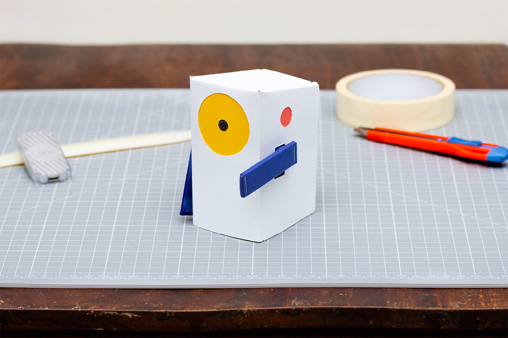
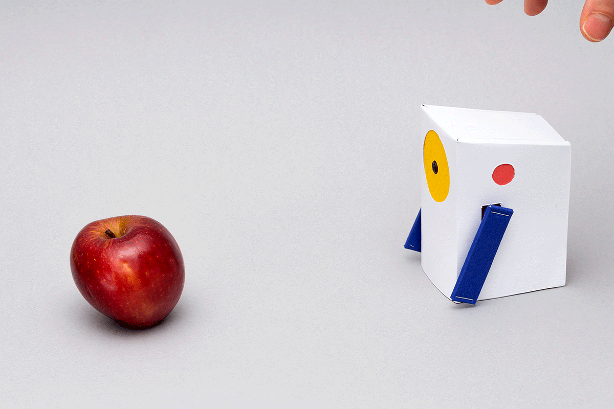
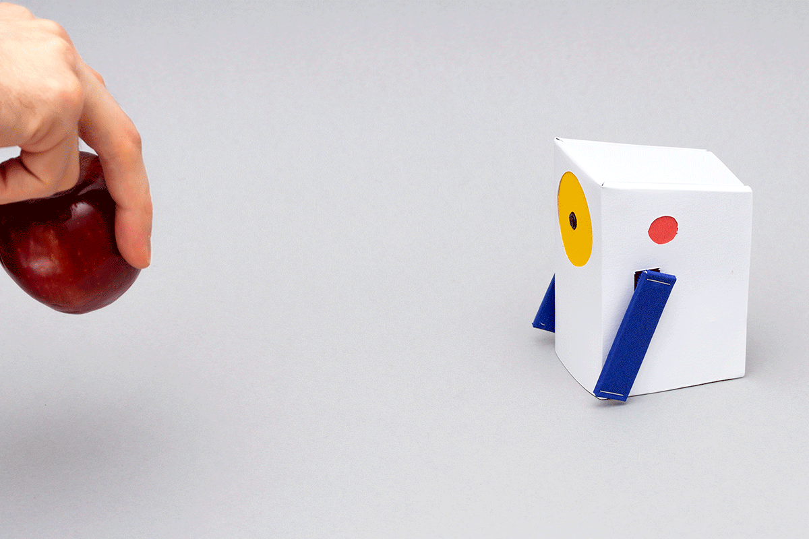
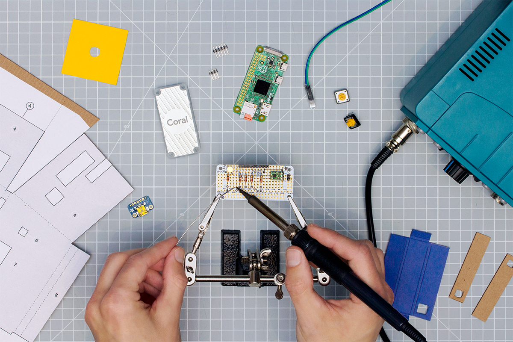
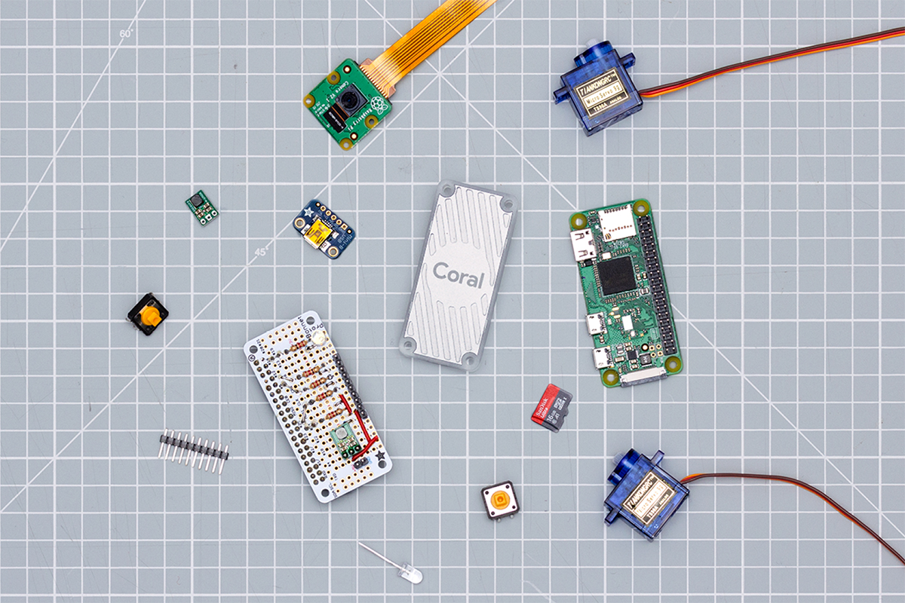
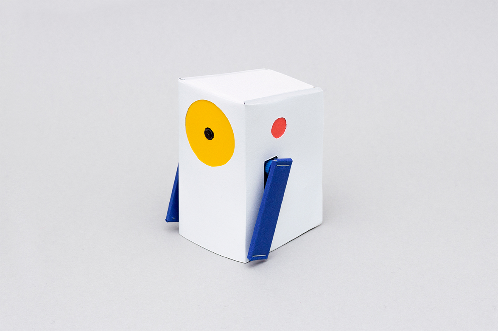
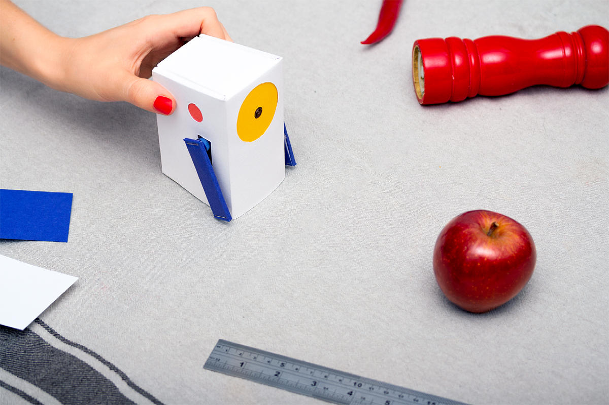
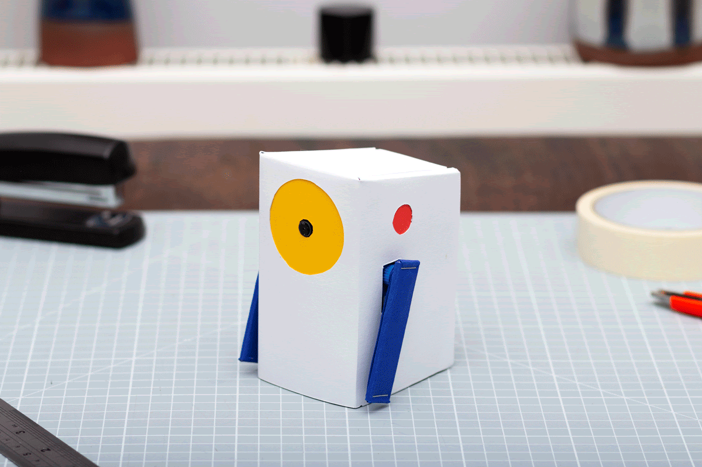
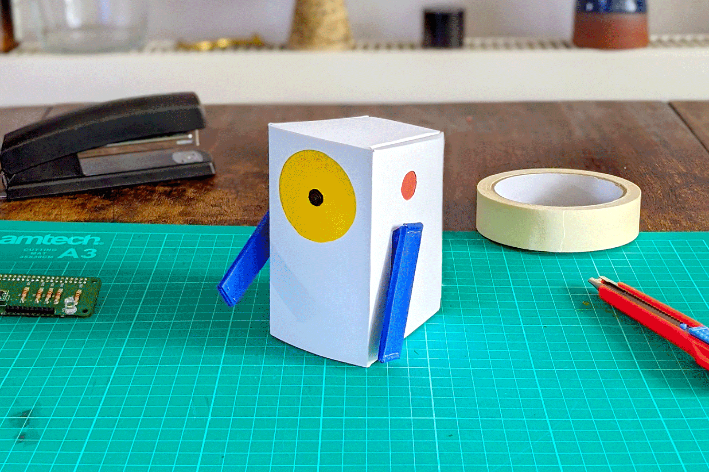

# Alto - a little teachable object 
 

Say hello to Alto, a little teachable object! Alto is designed to demonstrate the most basic aspects of machine learning (ML) by building a machine you can teach yourself. Alto uses the [Coral USB Accelerator](https://coral.ai/products/accelerator/) and Raspberry Pi to help show how you can easily add machine learning to your next hardware project.

This repository contains all of the instructions and files required to build an Alto of your own from scratch. Best of all, Alto is completely open source! Anyone can fork the code, schematics, and case designs to create a little teachable object of their own.

To find out more about what else you can do with the Edge TPU in the USB Accelerator, and get inspiration for your own projects, head to [Coral's Examples page](https://coral.ai/examples/).

 
 
## What you’ll find in this document

This document has five chapters:

-  **[User guide](#User-guide)** -
Explaining Alto’s interface and the ways Alto can be used.

-  **[Make your own Alto](#Make-your-own-Alto)** -
A visual guide to constructing your own Alto, covering setting up the software, soldering your circuitry and constructing Alto’s cardboard body.

- **[Experiment with Alto](#Experiment-with-Alto)** -
A set of simple experiments to help understand how Alto works, and how you can use Alto to introduce some of the basic concepts of machine learning to others.

- **[Remixing Alto](#Remixing-Alto-for-your-projects)** -
A brief introduction to how you can hack your Alto to look and behave differently to fit your own application.

- **[Technical overview](#Technical-Overview)** -
A more detailed overview of Alto’s software and electronics and how they function. 
 

## User guide

### Machine learning at its simplest

Alto has a camera on its front, and an arm and button on each side. Alto uses the camera to observe the world around it. The buttons are used to start learning, and Alto will point with its arm when it sees something it has learned to recognise. 

 
 

Alto can learn two classes of things. When Alto recognises one of them, it will point with its corresponding arm. Alto demonstrates machine learning at its most basic level: what you teach it to recognise is up to you!

 
 

### Teaching Alto

To teach Alto to recognise an object, place the object in front of it, and press one of the buttons on the side. As Alto takes images to learn about the object, its arm will slowly raise. When Alto’s arm is stretched out horizontally, the learning process has finished. Now, when the same object is placed in front of it, Alto will point at the object.

The more you teach Alto about the same object, the better it will become at recognising that thing. You can teach Alto as many times as you like! Try teaching Alto more about an object by rotating the object to show different angles and place it at various distances, pressing the same button each time.

It's important to try and balance the amount of learning that Alto does on each side. If it learns about one object 5 times, but only once about another, then it is likely to be much better at recognising the one that it has seen more often.

 
 
### Recognising objects

Start by teaching Alto to recognise a different object for each arm, for example, to teach Alto the difference between types of fruit, teach it about a red apple on one side, and a banana on the other. 

 
 
### Recognising classes

Beyond recognising individual objects, you can teach Alto to recognise classes of objects. Building on what it has learned about red apples, could you teach it to recognise red objects in general, rather than just apples? Once Alto has learned to recognise two classes, can it correctly recognise a new red object that it hasn’t seen before?

 
 
### Forgetting

If you want to teach Alto something new, you can clear its memory by holding down both buttons simultaneously for 3 seconds. This will erase everything Alto was taught on both sides, and can’t be undone.

To learn about any of these processes in more detail, take a look at the [Experiment with Alto](#experiment-with-Alto) section below.

 
 
## Make your own Alto

The following steps will guide you through the process of assembling your own Alto: setting up the Raspberry Pi, soldering the electronics, and assembling a case to house all the components. To read a more detailed explanation of each step, click on the links in each section to go to the individual instruction pages. 

 
 
### 1.0: [Set up the software](1.0-Set-up-the-software.md)

The first step is to setup the software environment for Alto, and then load the Python code that makes Alto function. The Software & OS section outlines the process in full, starting with setting up the Raspberry Pi Zero, flashing the SD card and installing the Alto application software.

 
 
### 2.0: [Build the electronics](2.0-Build-the-electronics.md)

The electronics for Alto have been designed to be as simple and hackable as possible. You only need a few common components and basic soldering skills to assemble everything. A full step-by-step guide, with schematics and a bill of materials, is included in the Electronics directory in this repository.

 
 
### 3.1: [Making the electronics casing](3.1-Making-the-electronics-casing.md)

The inner structure of Alto is made from folded cardboard, and held together with staples. All the components of Alto are held in this structure: the servos, LEDs, camera, and the internal electronics package are all mounted in the cardboard layers.

To begin, you will need to print out the [PDF template](casing/alto-paper-templates.pdf) and stick it to your materials. This will be your guide for cutting the cardboard into the correct shape. All the labels are printed on the template itself.

You can accomplish this step using hand tools (e.g. a craft knife) which will take around 45 minutes, or a laser cutter if you have access to one, which will be significantly quicker.

For more detailed instructions on this stage of constructing your Alto, refer to the [electronics casing](3.1-Making-the-electronics-casing.md) instructions.

 
 
### 3.2: [Making Alto's outer casing](3.2-Making-altos-outer-shell.md)

The outer structure of Alto is made from card, and is designed to fit around and fold into the seams of Alto’s inner structure. The process is similar to before, outlined in full detail on the [outer](https://github.com/googlecreativelab/alto/blob/master/3.2-Making-altos-outer-shell.md) case build directory.

The white card makes up most of Alto’s outer structure, and hides some of its components and electronics. We provide printable coloured card accessories that highlight the yellow eye (camera), the red ears (buttons) and the blue arms (servo motor arms).

You can also customise the visual style at this stage to make your Alto unique!

 
 
### 4.0: [Teach!](4.0-experiments-with-alto.md)

You should now have a completed Alto unit – the next stage is to teach it!

Grab some objects, plug Alto into a power source, and start exploring what you can teach Alto to recognise. If you need a bit of inspiration to get going, take a look at the Experimenting with Alto section below.

 
 
## [Experiment with Alto](4.0-experiments-with-alto.md)

Alto is a great way to understand the basics of machine learning. This section contains a number of experiments to help understand how Alto works, and introduce the basics of machine learning to others.

Covering aspects from simple object recognition, to introducing k-nearest neighbor (kNN) algorithms, these experiments give practical ways to bring the concepts behind Alto to life. Head to the [Experiments with Alto](4.0-experiments-with-alto.md) page to read on.

 
 
## [Remixing Alto for your projects](5.0-remixing-alto.md)

All the hardware and software for Alto was created with hacking and remixing in mind: the case design can be made from different materials, or refactored entirely; the electronics can be adapted to use whatever components you have available; the servos can be substituted for any type of actuator; and the software is written in a high level language (Python) that is easy to modify. 

Here are just some of the ways you can hack your own Alto:

 
 
### Hacking the [software](5.0-remixing-alto.md#hacking-altos-software)
Small tweaks to the existing code can be made to change Alto’s confidence level or behaviours.

 
 
### Hacking the [hardware](5.0-remixing-alto.md#hacking-altos-hardware)

Go beyond servos, to explore new ways for Alto to show its recognised something.

 
 
### Hacking the [casing](5.0-remixing-alto.md#hacking-altos-casing)

The casing for Alto can easily be changed to fit whatever application you might have in mind. Whether that’s simple aesthetic changes to modify Alto’s look, or changes to the design of the arms or body that might let Alto do new things. 

 
 
Hacking Alto is a great step towards building your own machine learning projects. If you come up with anything cool using the Coral USB Accelerator, show us! Submit your machine learning experiment to the Experiments with Google platform [here](https://experiments.withgoogle.com/submit).

## Technical Overview

There are three main elements to Alto: a Raspberry Pi Zero single-board computer with a camera attachment; a [Coral USB Accelerator](https://coral.ai/products/accelerator/) for accelerating on-device machine learning; and some simple electronics for its user interface. 
 

### OS & compute

The Raspberry Pi Zero runs Raspberry Pi OS. It is responsible for interfacing with the user’s connected hardware (connected via GPIO), the camera module, and the Coral Edge TPU (connected via USB). The OS starts automatically, and acts as host for the software application that runs Alto. 

The system accelerates all ML inferencing (and some of the learning) by delegating ML graph execution to the Edge TPU on the Coral USB Accelerator. The Edge TPU is a machine learning coprocessor that enables low-powered computers like the Raspberry Pi to run advanced ML workloads at a much greater level of performance than if they were run on CPU. All of the ML tasks performed by Alto are done on-device (offline) using the Edge TPU.

Although the Coral software for the Edge TPU does not officially support the Raspberry Pi Zero (because it has an ARMv6 chipset, but Coral officially requires ARMv8), the [Coral software for the Edge TPU Runtime](https://github.com/google-coral/libedgetpu) is open sourced and has been successfully [compiled for the Raspberry Pi Zero](https://github.com/google-coral/edgetpu-platforms).

You can find out more about Coral and the Edge TPU hardware on the [Coral website](https://coral.ai/products/). 
 

### Software

The Alto software application is written in Python. It receives input from the Raspberry Pi camera module, prepares it for classification by the Edge TPU module, and interfaces with the electronics interface. The application uses a k-nearest neighbor classifier model (k-NN) to identify the proximity of a given image to others in its learned dataset.

When Alto is learning, it calculates the embedding of the incoming data from the image sensor in its model and assigns it a label - in the case of Alto, this label is either its left or right arm. When Alto is in recognition mode, the embeddings of data frames from the image sensor are determined and their proximity to other known embeddings is calculated; if these are within a certain distance of a labelled embedding, then Alto has recognised something, and will point at it with its corresponding arm. 
 

### Electronics

The electronics for Alto are designed to be as flexible and hackable as possible. It is based around a single through-hole prototyping board which can be assembled easily by hand. This board connects to the GPIO pins of the Raspberry Pi Zero, and breaks out headers for the other component parts of Alto: two servos, two buttons, and one LED.

Each of these items are common and easy to get, or you might even have them in your hacking space already. Alternatively, they can easily be substituted for other parts, for example if you have different servos or LEDs available. The design and Bill of Materials (BOM) includes a prefabricated USB breakout board, which includes a discrete power regulation circuit that will ensure smooth delivery of adequate power to Alto during normal operation.

You can find more information about the electronics in the [electronics](2.0-Build-the-electronics.md) directory, and the bill of materials is available [here](electronics/alto-bom.xlsx) as a downloadable spreadsheet. 
 

## Notes

This is a collaborative effort between Google Creative Lab and our partners at [RRD Labs](https://github.com/dgym). This is not an official Google product.

We encourage open sourcing projects as a way of learning from each other. Please respect our and other creators’ rights, including copyright and trademark rights when present when sharing these works and creating derivative work. If you want more info on Google's policy, you can find it [here](https://www.google.com/permissions/). To contribute to the project, please refer to the [contributing](CONTRIBUTING.md) document in this repository.
